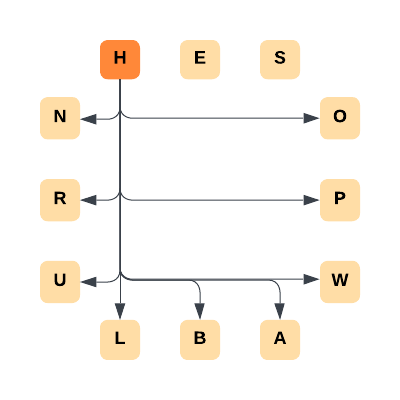
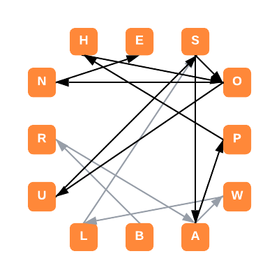

# BuzzOff

This project creates a list of possible words that can be created from a set of letters.
It is definitely not designed to assist with The New York Times' [Spelling Bee](https://www.nytimes.com/puzzles/spelling-bee) or [Letter Boxed](https://www.nytimes.com/puzzles/letter-boxed) puzzles.
Pinky promise.

## Spelling Bee

To see what words can be made with the set of letters `yaehlpt` that contain `y`, run it!

```console
% buzz off -m y yaehlpt
allay
alley
ally
...
```

## Letter Boxed

To see what words can be made from the following Letter Boxed problem, try the following to get an answer of `brawls` and `sousaphone`:

```console
 HES
O   A
P   B
W   L
 URN
```

```console
% buzz letterboxed hesopwablurn
brawls sousaphone
```

Solutions are found by exploring the graph made by letters, and comparing reachable words against a trie of English words.
Here are the outgoing edges of one node:



The solution: `BRAWLS-SOUSAPHONE`



## Installation

To install this project:

```console
% cd buzzoff
% python -m pip install .
```
